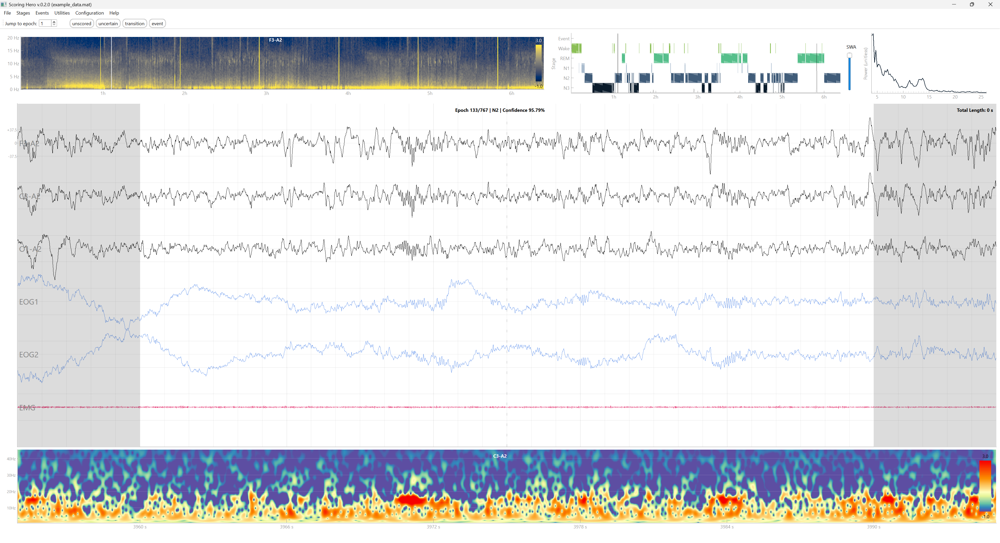
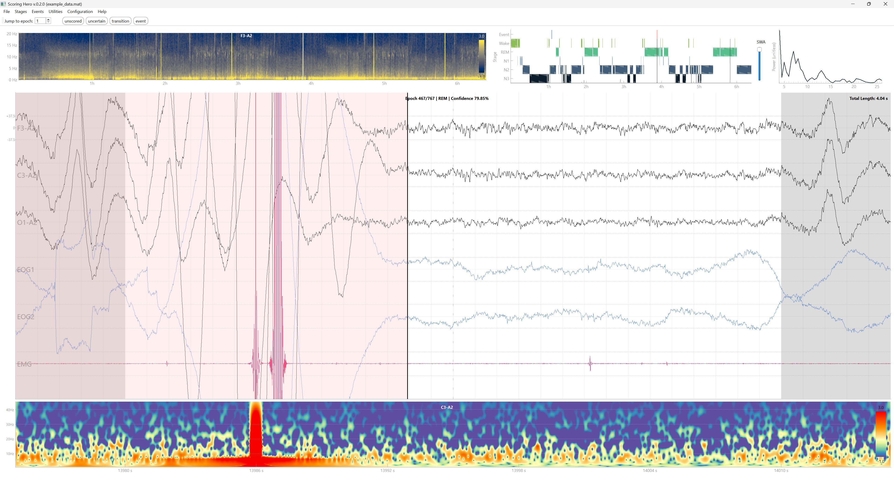
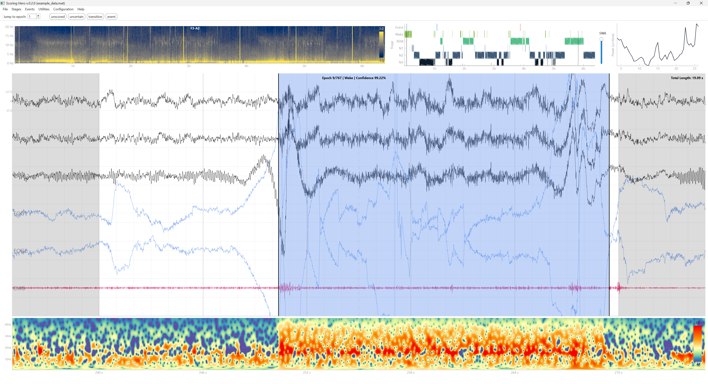
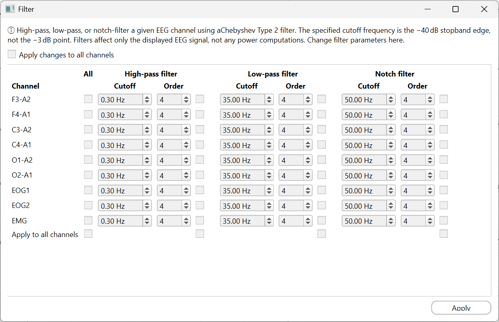
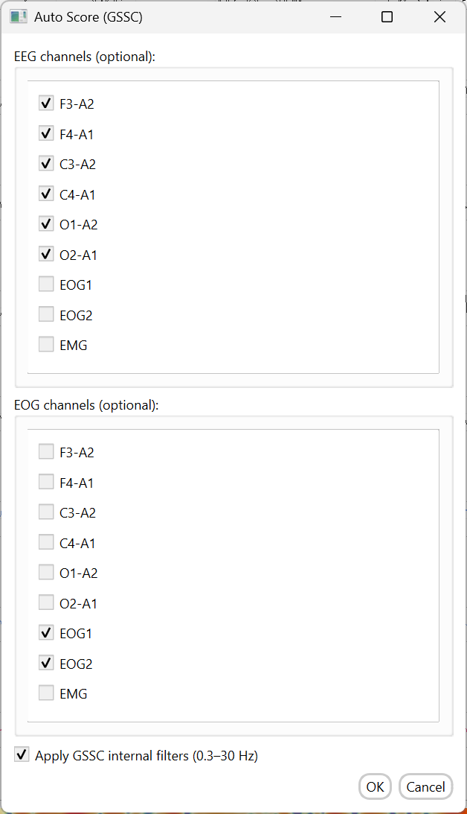
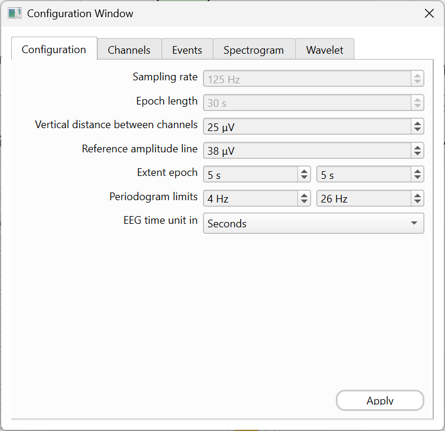
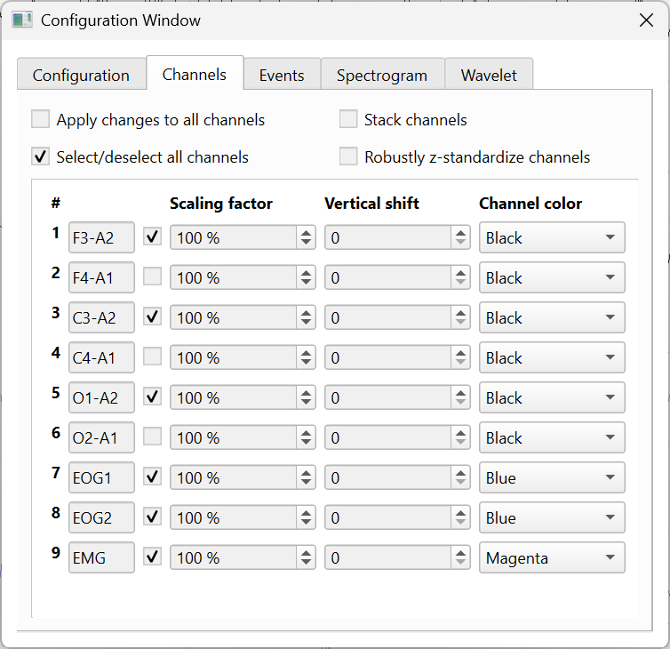
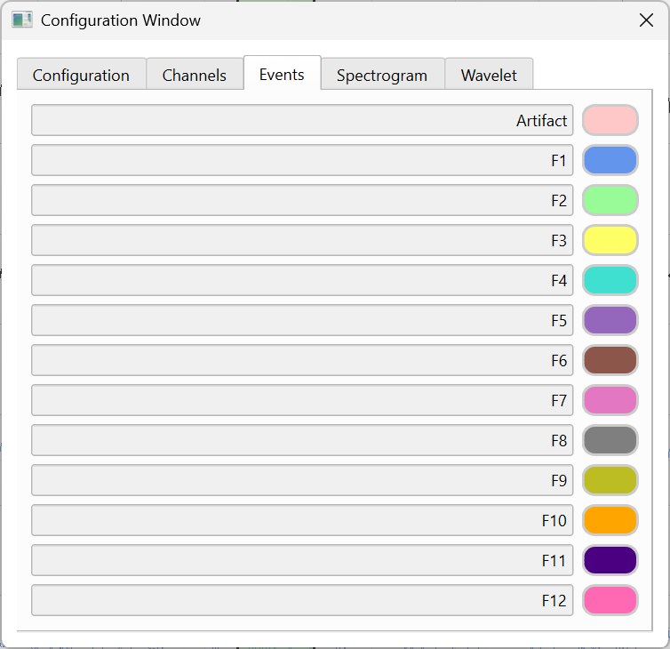
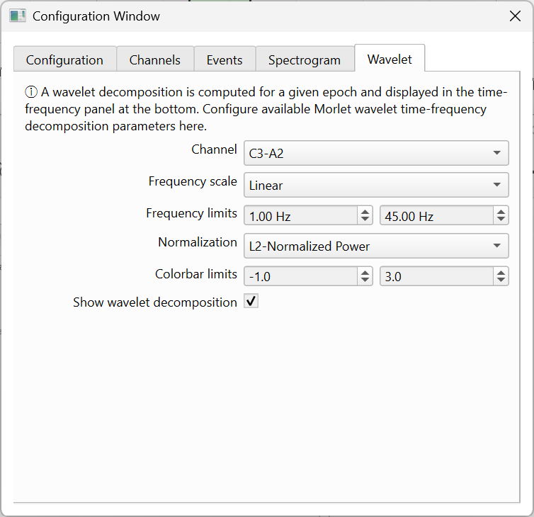

# ScoringHero - The Open-Source Sleep EEG Scoring Software

Welcome to **ScoringHero**, an open-source project designed to assist you in EEG sleep scoring! After being tested and used by multiple labs for over a year, **ScoringHero** has now reached its beta stage and supports cross-platform compatibility.



---

## About

**ScoringHero** is an open-source tool for visualizing long-term EEG recordings, marking events (such as sleep spindles, artefacts, or anything really), and performing sleep scoring. It is built with PySide6 (Qt6) and designed for researchers and clinicians who need a fast, keyboard-driven workflow for sleep stage classification.

---

## Getting Started

### Download the Latest Release

**ScoringHero** is available for **Windows** and **macOS**. For Windows, it is packaged as a standalone executable (`.exe`). For macOS, it comes in versions for older (`x86_64 architecture`) and newer Mac laptops (`arm64 architecture`).

No installation is required. Simply go to the **Releases** section on the right of this page, download the appropriate file for your operating system, and execute the file to start **ScoringHero**.

### For Mac Users

**ScoringHero** is not registered with Apple (as this would imply a yearly fee). This means you need to manually allow its execution. Follow these steps to run the software:
1. Open Terminal and navigate to your Downloads folder.
2. Run the following command to give execution rights to the software:
   - `chmod +x scoringhero_macOS_arm64` (for ARM64 version)
   - `chmod +x scoringhero_macOS_x86_64` (for x86_64 version)
3. Go to System Preferences > Privacy & Security.
4. Click **Open Anyway** when you see the message: *"scoringhero_macOS_arm64 was blocked to protect your Mac."*

### Running from Source

Requires [uv](https://docs.astral.sh/uv/getting-started/installation/) and Python 3.14.3.

```bash
# Clone the repository
git clone https://github.com/SvennoNito/ScoringHero.git
cd ScoringHero

# Install dependencies and run
uv sync
uv run scoringhero.py
```

### Building Standalone Binaries

**Windows:**
```bash
uv sync --extra build-win
./build-win.bat
# Output: dist/scoringhero.exe
```

**macOS** (both architectures, via GitHub Actions on release):
```bash
uv sync --extra build-mac
arch -arm64 ./release-mac.sh   # ARM64
arch -x86_64 ./release-mac.sh  # x86_64
```

---

## Features

### Multi-Channel EEG Signal Display
- View multiple EEG channels simultaneously with configurable vertical spacing
- Per-channel amplitude scaling and vertical offset adjustment
- 6 channel colors: Black, Blue, Green, Magenta, Orange, Cyan
- Amplitude reference lines and 1-second grid overlay
- Configurable time axis units: Seconds, Minutes, or Hours
- **Stack channels** on a shared baseline for overlay comparison
- **Robust z-standardization** (median/IQR normalization) for cross-channel comparison
- Select/deselect all channels or apply settings to all channels at once

### Sleep Stage Scoring
- Score epochs as **Wake** (`W`), **N1** (`1`), **N2** (`2`), **N3** (`3`), **REM** (`R`), or **Inconclusive** (`I`)
- Clear a score with `Delete`
- **Confidence flagging**: press `Q` to mark an epoch as uncertain for later review
- Track scoring progress with an on-screen epoch counter
- Automatic save prompt on close if epochs remain unscored

### Event Annotation
- **13 event types**: Artefact (`A`) + 12 fully customizable events (`F1`–`F12`)
- Label each event type with a custom name (e.g., "Sleep spindle", "K-complex", "Slow wave")
- Assign custom colors from a 13-color palette
- Draw event regions directly on the signal using click-and-drag rectangles
- Real-time display of event duration (seconds) and amplitude while drawing
- Double-click on an existing event to remove it
- Overlapping events of the same type are automatically merged
- Events are displayed on both the signal view and the hypnogram

<p align="center">
    
    
</p>

### Smart Navigation
| Button / Action | Description |
|----------------|-------------|
| **[unscored]** | Jump to the next epoch that hasn't been scored yet |
| **[uncertain]** | Jump to the next epoch flagged with low confidence |
| **[transition]** | Jump to the next sleep stage change |
| **[event]** | Jump to the next epoch containing a marked event |
| **Epoch spinbox** | Type any epoch number to jump there directly |
| **Click on hypnogram** | Navigate to any time point by clicking the hypnogram |
| **Click on spectrogram** | Navigate to any time point by clicking the spectrogram |

### Spectrogram Panel
- Welch power spectral density computed across the full recording
- Configurable frequency range (default: 0–20 Hz)
- Adjustable colorbar power limits (log10 scale)
- Select which channel to display
- Cached computation — no recalculation when navigating epochs

### Hypnogram Panel
- Full-night sleep architecture timeline with color-coded stages
- Current epoch position indicator
- **Slow-wave activity (SWA) overlay** showing delta power across the night
- Adjustable SWA smoothing via a slider with median filter kernel control
- Event markers displayed directly on the hypnogram

### Morlet Wavelet Time-Frequency Panel
- Complex Morlet wavelet decomposition via FFT-based convolution
- Adaptive cycle count per frequency for optimal time-frequency resolution trade-off
- **4 normalization modes:**
  - Raw Power
  - L2-Normalized Power (unit energy wavelets)
  - Z-Standardized Power (zero-mean, unit variance)
  - dB (median baseline) normalization
- Linear or logarithmic frequency scale
- Configurable frequency range (default: 1–45 Hz)
- Extended epoch padding to minimize edge artifacts
- Can be toggled on/off to save screen space

### Periodogram Panel
- Welch periodogram of any user-selected EEG region
- Draw a rectangle on the signal to compute the power spectrum of that region
- Configurable frequency band display
- Updates automatically when a selection is drawn or modified

### Signal Filtering



- Apply **high-pass**, **low-pass**, and/or **notch** filters to each EEG channel independently
- Uses a Chebyshev Type 2 filter (zero-phase via forward-backward pass)
- Configurable **cutoff frequency** and **filter order** per channel
- The specified cutoff is the −40 dB stopband attenuation point
- Filters affect only the **displayed EEG signal** — power computations (spectrogram, wavelet, SWA) are unaffected
- **Apply to all channels** checkbox to propagate settings across all channels at once

### Automatic Sleep Scoring (GSSC)



- One-click automatic sleep scoring via the **Greifswald Sleep Stage Classifier (GSSC)**
- Select which channels to pass as **EEG** and **EOG** inputs (both optional)
- Option to apply GSSC's internal bandpass filter (0.3–30 Hz) before scoring
- Predicted stages are imported directly into ScoringHero and can be reviewed, corrected, and exported like any other scoring

### Zoom
- Draw a rectangle on the signal and press `Z` to zoom into that region
- Inspect fine-grained signal details at any scale

---

## Supported File Formats

### EEG Data Import

| Format | Extension | Notes |
|--------|-----------|-------|
| EEGLAB | `.mat` | MATLAB v5 and v7.3+ (HDF5). Reads `EEG.data`, `EEG.srate`, and `EEG.chanlocs` |
| EDF | `.edf` | European Data Format, read via pyedflib |
| EDF (Volt-scaled) | `.edf` | For EDF files recorded in Volts — auto-converts to µV |
| Zurich R09 | `.r09` | Legacy format support |

#### EEGLAB `.mat` — Required Structure

ScoringHero expects the file to contain a top-level `EEG` struct with the following fields:

| Field | Type | Description |
|-------|------|-------------|
| `EEG.data` | numeric array `(n_channels × n_samples)` | Raw EEG signal (µV typical, any unit accepted) |
| `EEG.srate` | scalar | Sampling rate in Hz |
| `EEG.chanlocs` | struct array | Channel metadata — only the `labels` field is read |
| `EEG.chanlocs(i).labels` | string | Channel name for channel `i` |

Both **MATLAB v7 and earlier** (via `scipy.io.loadmat`) and **MATLAB v7.3+ / HDF5** (via `h5py`) are supported. The loader auto-detects which format applies.

Robustness notes:
- If `data` is stored transposed `(n_samples × n_channels)`, it is automatically corrected.
- If `chanlocs` is missing or has the wrong number of entries, names fall back to `CH1, CH2, …, CHn` with a console warning.

**Minimal working example (MATLAB):**
```matlab
EEG.data              = randn(2, 125 * 30 * 100);  % 2 channels, 100 × 30 s epochs @ 125 Hz
EEG.srate             = 125;
EEG.chanlocs(1).labels = 'C3-A2';
EEG.chanlocs(2).labels = 'C4-A1';
save('myrecording.mat', 'EEG', '-v7.3');            % -v7.3 required for files > 2 GB
```

#### EDF (`.edf`)

Standard European Data Format, loaded with pyedflib (`pyedflib.EdfReader`). No special structure beyond a valid EDF file. A second loader variant auto-converts Volt-scaled signals to µV.

#### Zurich R09 (`.r09`)

Legacy binary format. Fixed 9-channel layout at 128 Hz with hardcoded channel names: `F3-A2, F4-A1, C3-A2, C4-A1, O1-A2, O2-A1, EOG1, EOG2, EMG`. Samples stored as `int16`.

---

### Scoring Import

| Format | Extension | Source | Notes |
|--------|-----------|--------|-------|
| ScoringHero | `.json` | Native | Full stages + events + confidence |
| YASA | `.txt` | Yet Another Spindle Algorithm | One stage per line |
| Sleeptrip | `.csv` | MATLAB Sleeptrip toolbox | Single column, numeric encoding |
| Sleepyland | `.annot` | Sleepyland | Includes per-stage confidence scores |
| GSSC | `.csv` | Greifswald Sleep Stage Classifier | Includes per-stage confidence |
| Zurich VIS | `.vis` | Zurich scoring format | 20-second epoch standard |

#### YASA (`.txt`)

Plain text, one stage label per line (one line = one epoch). Lines that do not match a known token are skipped.

| Accepted token(s) | Stage |
|-------------------|-------|
| `W`, `WAKE` | Wake |
| `N1`, `NREM1`, `1` | N1 |
| `N2`, `NREM2`, `2` | N2 |
| `N3`, `NREM3`, `3` | N3 |
| `R`, `REM`, `Rem`, `4` | REM |

#### Sleeptrip (`.csv`)

CSV with one numeric code per row (first column used, header optional).

| Value | Stage |
|-------|-------|
| `0` | Wake |
| `1` | N1 |
| `2` | N2 |
| `3` | N3 |
| `5` | REM |

#### SleepyLand (`.annot`)

Tab-separated file with a header row. Column 1 contains the stage label (`W`, `N1`, `N2`, `N3`, `R`). Column 5 (meta) contains semicolon-separated probabilities used as confidence:

```
pW=0.10;pN1=0.05;pN2=0.75;pN3=0.08;pR=0.02
```

#### GSSC (`.csv`)

CSV with header: `Epoch, Time, Stage, Conf_W, Conf_N1, Conf_N2, Conf_N3, Conf_R`.

| Stage value | Stage |
|-------------|-------|
| `0` | Wake |
| `1` | N1 |
| `2` | N2 |
| `3` | N3 |
| `4` | REM |

Confidence for the assigned stage is read from the corresponding `Conf_*` column.

#### Zurich VIS (`.vis`)

Space-separated text. First line is an epoch offset (usually `0`). Each subsequent line: `<epoch_number> <stage_code> [optional comment]`.

| Code | Stage |
|------|-------|
| `0` | Wake |
| `1` | N1 |
| `2` | N2 |
| `3` | N3 |
| `r` | REM |
| `e` | End marker — replaced by the previous epoch's stage |

Default epoch length assumed: 20 s. Missing epochs are forward-filled.

---

### Scoring Export & Native JSON Format

ScoringHero saves scoring to `{filename}.json` next to the EEG file. The file is a JSON array with exactly two elements:

```
[ <stages>, <annotations> ]
```

**Element 0 — stages:** one dict per epoch:

```json
{
  "epoch":      1,       // 1-indexed epoch number
  "start":      0,       // epoch start time in seconds
  "end":        30,      // epoch end time in seconds
  "stage":      "N2",    // human-readable label (see encoding table)
  "digit":      -2,      // numeric code (see encoding table)
  "confidence": 0.85,    // model confidence 0–1, or null
  "channels":   [],      // reserved, always []
  "clean":      1,       // 1 = clean, 0 = artifact
  "source":     "YASA"   // originating tool, or null
}
```

**Stage encoding:**

| `stage` | `digit` |
|---------|:-------:|
| `"Wake"` | `1` |
| `"N1"` | `-1` |
| `"N2"` | `-2` |
| `"N3"` | `-3` |
| `"REM"` | `0` |
| `null` (unscored) | `null` |

**Element 1 — annotations:** one dict per marked event:

```json
{
  "key":     "A",      // shortcut key assigned to this event type
  "event":   "Spindle", // human-readable event label
  "digit":   0,         // annotation type index (0–12; 0 = Artefact, 1–12 = F1–F12)
  "counter": 3,         // sequential index within this event type
  "epoch":   7,         // epoch where the event occurs
  "start":   195.2,     // absolute start time in seconds
  "end":     196.8      // absolute end time in seconds
}
```

Up to 13 annotation types are supported (indices 0–12).

---

## Keyboard Shortcuts

### Sleep Stage Scoring

| Key | Action |
|-----|--------|
| `W` | Score as Wake |
| `1` | Score as N1 |
| `2` | Score as N2 |
| `3` | Score as N3 |
| `R` | Score as REM |
| `I` | Score as Inconclusive |
| `Delete` | Remove score (set to None) |
| `Q` | Toggle "Not sure" confidence flag |

### Event Marking

| Key | Action |
|-----|--------|
| `A` | Mark drawn region as Artefact |
| `F1`–`F12` | Mark drawn region as Event 1–12 (labels customizable in config) |

### Navigation & Tools

| Key | Action |
|-----|--------|
| `→` | Next epoch |
| `←` | Previous epoch |
| `Z` | Zoom on selected EEG region |
| `Ctrl+S` | Save scoring |
| `Ctrl+C` | Open configuration window |
| `Ctrl+H` | Show help |

---

## Configuration

Open the configuration window with `Ctrl+C`. Settings are saved per-file as `{filename}.config.json` alongside the EEG data.

### General Tab


- Sampling rate (Hz)
- Epoch length (seconds)
- Distance between channels (µV)
- Reference amplitude line (µV)
- Extension epoch duration for wavelet edge-artifact handling
- Periodogram frequency limits
- EEG panel time unit (Seconds / Minutes / Hours)

### Channels Tab



- Per-channel: name, visibility toggle, color, scaling factor (%), vertical shift (µV)
- Apply changes to all channels at once
- Select / deselect all channels
- Stack channels on the same baseline
- Robust z-standardize channels

### Events Tab


- Custom label for each of the 12 event types
- Custom color assignment from a 13-color palette

### Spectrogram Tab
- Channel selection for spectrogram computation
- Frequency display limits (Hz)
- Colorbar power limits

### Wavelet Tab



- Channel selection for wavelet computation
- Frequency scale: Linear or Logarithmic
- Frequency display limits (Hz)
- Normalization mode: Raw Power, L2-Normalized, Z-Standardized, or dB (median baseline)
- Per-mode colorbar power limits
- Toggle wavelet panel visibility

---

## Signal Processing Details

### Spectrogram
- Welch method: 4-second Hann window, 2-second hop, constant detrending
- Power displayed on log10 scale with Cividis colormap
- Computed once and cached for the session

### Morlet Wavelet Time-Frequency
- FFT-based convolution with complex Morlet wavelets
- Adaptive `n_cycles` per frequency: ranges from 3 (low frequencies) to `freq/2` (high frequencies)
- Extended epoch signal used to avoid edge artifacts
- Results cached per channel and settings

### Periodogram
- Welch periodogram of the signal within a user-drawn rectangle
- Min-max scaled to [0, 1] for display
- Trimmable to a frequency band of interest

### Slow-Wave Activity
- Delta band (0.5–4 Hz) power per epoch
- Displayed as an overlay on the hypnogram
- Smoothing controlled by a slider (median filter with adjustable kernel)

---

## Architecture

```
scoringhero.py              Main entry point and window
├── ui/setup_ui.py          Widget layout and signal/slot wiring
├── widgets/                PySide6 custom widgets
│   ├── signal_widget       Multi-channel EEG signal display
│   ├── spectogram_widget   Welch spectrogram panel
│   ├── hypnogram_widget    Sleep stage timeline
│   ├── tf_widget           Morlet wavelet time-frequency
│   └── ...                 Slider, periodogram, paint overlay, etc.
├── eeg/                    EEG file loaders (EEGLAB, EDF, R09)
├── scoring/                Scoring import/export (6 formats)
├── signal_processing/      Spectrogram, Morlet TF, periodogram, SWA
├── events/                 Event annotation handling
├── config/                 Configuration window and settings I/O
├── mouse_click/            Click handlers for hypnogram/spectrogram
├── paint_event/            Event rectangle drawing overlay
├── utilities/              GUI state (refresh, redraw, zoom, navigation)
├── cache/                  Computed data caching
├── style/                  QSS dark theme
└── help/                   Help content and images
```

---

## Dependencies

Key libraries:
- **PySide6** — Qt6 Python bindings (GUI framework)
- **NumPy** / **SciPy** — Numerical computing and signal processing
- **Matplotlib** — Plotting backend for signal and spectral displays
- **pyedflib** — EDF file reading
- **h5py** — HDF5 support for MATLAB v7.3+ files
- **PyQtGraph** — Fast interactive plotting
- **PyWavelets** — Wavelet transforms

See [pyproject.toml](pyproject.toml) for the full dependency list and [uv.lock](uv.lock) for pinned versions.

---

## Contributing

Contributions are welcome! Please follow the existing commit convention:
- `[NEW]` — New feature or capability
- `[FIX]` — Bug fix
- `[ADD]` — Enhancement to existing feature
- `[MOD]` — Code modification or refactoring

---

## How to Cite

If you use **ScoringHero** in your work, please cite this software using the metadata found under *"Cite this repository"* on the top right of this page.

---

## Support the Project

[Buy me a coffee](https://ko-fi.com/Svennonito) or [sponsor me on GitHub](https://github.com/sponsors/SvennoNito) to help keep updates coming!
Every little bit fuels late-night coding sessions — thanks for being awesome!
